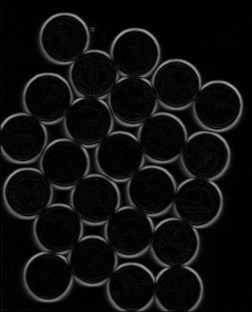

# GoCVSamples
Some sample code examples for GoCV.

1. [Sobel Derivatives](https://docs.opencv.org/master/d2/d2c/tutorial_sobel_derivatives.html)

</img>
</img>

To try it out, from the root, run:  

`go run cmd/sobel/main.go <imgFile>`
